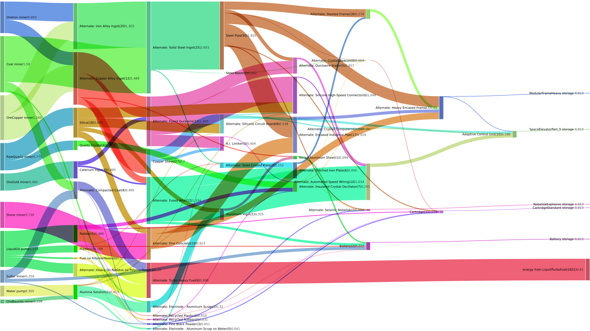

# satisfactorysimulator
Simulator for the game satisfactory. Requires a dump from the game-configuration.
No attempt has been made to made to make this polished or user-friendly.

Dependencies: rapidjson, c++-11


Structure of main, edit this at your convenience:
```
int main(){
    // parse and load the configuration: all resources&items, all recipes and all the power generating buildings.
    World w;                                                                                                                                                                                                                                                                                                                                 
    w.loadFromCommunityResourcesDocsJson("Docsv0322.json"); 
    // add additional recipes to help fix problems: variations on existing recipes where one of the outputproducts is discarded.

    createRecipeWithoutOutput("Fuel","PolymerResin"); // as if the polymerressin will be fed to the shredder.
    ...
    
    // Prepare a simulation with a strategy:
    //  for each resource there will be a demand and a customised sequence of recipes to obtain it.
    // To satisfy demand the sequence of recipes will be iterated,
    // the first recipe for which there is enough demand will be executed for a limited amount.
    Simulation s (&w);
    s.resource_to_waytoobtainit[w.getResourceNC("Cement")]  = {
                //w.getRecipeNC("Concrete"),
                //w.getRecipeNC("Alternate: Rubber Concrete"),
                //w.getRecipeNC("Alternate: Wet Concrete"),
                w.getRecipeNC("Alternate: Fine Concrete"),
    };
    ...

    // Next the initial demand is set.
    // All the simulation starts from there.
    // By default all demand is 0.
    s.setDemand("MotorLightweight",10);
    ...

    // Run the simulation.
    // During the simulation lots of statistics will be kept.
    s.run(); // internally there is a while-loop that goes on till the state doesnt change anymore (or is in a loop)

    // now there are various ways of getting those statistics.
    // - just dump all recipes and what they did.
    // - dump all resources and what they did.
    // - dump each flow from one recipe to another, ideal for sankey-diagrams.
    //    --> part of the output can be copied straight to
    //        https://observablehq.com/@mbostock/flow-o-matic 

}
```


This layout seemed efficient for satisfactory shortly after update 3 at the beginning of march 2020:

  

Textual output could list stuff like this:

```
resourcetype                                   demand                                    input
------------------------------------------------------------------------------------------------
 Cement                                        480.0 (       0.6 convmk5) 
 IronPlate                                     118.5 (       0.2 convmk5) 
 CartridgeStandard                              10.0 (       0.0 convmk5) 
 Wire                                         1040.4 (       1.3 convmk5) 
 IronPlateReinforced                            35.6 (       0.0 convmk5) 
 CopperIngot                                  1161.1 (       1.5 convmk5) 
 SpaceElevatorPart_3                            75.0 (       0.1 convmk5) 
 SpaceElevatorPart_5                            10.0 (       0.0 convmk5) 
 IronIngot                                    1015.3 (       1.3 convmk5) 
 AluminumPlate                                  26.7 (       0.0 convmk5) 
 Rubber                                        111.7 (       0.1 convmk5) 
 CircuitBoard                                   95.4 (       0.1 convmk5) 
 CopperSheet                                   272.9 (       0.3 convmk5) 
 Plastic                                        46.7 (       0.1 convmk5) 
 SteelPlateReinforced                           66.7 (       0.1 convmk5) 
 SteelPipe                                    1001.0 (       1.3 convmk5) 
 LiquidFuel(m3)                                 10.4 (       0.0 pipes  ) 
 HeavyOilResidue(m3)                           228.9 (       0.8 pipes  ) 
 ModularFrame                                   53.3 (       0.1 convmk5) 
 SteelIngot                                   1522.9 (       2.0 convmk5) 
 AluminaSolution(m3)                            96.0 (       0.3 pipes  ) 
 AluminumScrap                                 160.0 (       0.2 convmk5) 
 AluminumIngot                                  53.3 (       0.1 convmk5) 
 Silica                                        681.6 (       0.9 convmk5) 
 Computer                                       10.0 (       0.0 convmk5) 
 ModularFrameHeavy                              20.0 (       0.0 convmk5) 
 SteelPlate                                      0.4 (       0.0 convmk5) 
 GoldIngot                                     126.0 (       0.2 convmk5) 
 HighSpeedConnector                             18.8 (       0.0 convmk5) 
 Stator                                         37.5 (       0.0 convmk5) 
 CircuitBoardHighSpeed                          12.6 (       0.0 convmk5) 
 HighSpeedWire                                1095.8 (       1.4 convmk5) 
 QuartzCrystal                                 126.0 (       0.2 convmk5) 
 LiquidTurboFuel(m3)                           183.1 (       0.6 pipes  ) 
 CrystalOscillator                              12.6 (       0.0 convmk5) 
 Gunpowder                                      40.0 (       0.1 convmk5) 
 Battery                                        10.0 (       0.0 convmk5) 
 NobeliskExplosive                              10.0 (       0.0 convmk5) 
 Water(m3)                                     120.0 (       0.4 pipes  )       91.6 (       0.3 pipes  )
 OreIron                                       696.4 (       0.9 convmk5)      696.4 (       0.9 convmk5)
 OreCopper                                     986.7 (       1.3 convmk5)      986.7 (       1.3 convmk5)
 Stone                                         576.0 (       0.7 convmk5)      576.0 (       0.7 convmk5)
 Coal                                         1240.4 (       1.6 convmk5)     1240.4 (       1.6 convmk5)
 LiquidOil(m3)                                 305.4 (       1.0 pipes  )      305.4 (       1.0 pipes  )
 OreBauxite                                     84.0 (       0.1 convmk5)       84.0 (       0.1 convmk5)
 OreGold                                       378.0 (       0.5 convmk5)      378.0 (       0.5 convmk5)
 RawQuartz                                     604.6 (       0.8 convmk5)      604.6 (       0.8 convmk5)
 Sulfur                                        279.8 (       0.4 convmk5)      279.8 (       0.4 convmk5)
 CompactedCoal                                 193.1 (       0.2 convmk5) 
 energyMJ                                   366235.1 (    6103.9 MW     )        0.0 (       0.0 MW     )
 _TFuel                                          0.3 minutes (or buildings)
 _TPlastic                                       2.0 minutes (or buildings)
 _TRubber                                        4.9 minutes (or buildings)
 _TCopper Sheet                                 27.3 minutes (or buildings)
 _TAlternate: Copper Alloy Ingot                11.6 minutes (or buildings)
 _TAlternate: Electrode - Aluminum Scrap         1.1 minutes (or buildings)
 _TAlclad Aluminum Sheet                         0.9 minutes (or buildings)
 _TAlumina Solution                              1.2 minutes (or buildings)
 _TAluminum Ingot                                0.7 minutes (or buildings)
 _TAlternate: Fused Wire                        11.6 minutes (or buildings)
 _TAdaptive Control Unit                        10.0 minutes (or buildings)
 BlueprintGeneratedClass__/Game/FactoryGame/Resource/Equipment/Beacon/BP_EquipmentDescriptorBeacon.BP_EquipmentDescriptorBeacon_C__        2.0 (       0.0 convmk5) 
 _TAlternate: Heavy Oil Residue                  2.8 minutes (or buildings)
 _TAlternate: Automated Speed Wiring            10.0 minutes (or buildings)
 _TA.I. Limiter                                  2.5 minutes (or buildings)
 _TQuartz Crystal                                5.6 minutes (or buildings)
 _TAlternate: Recycled Rubber                    0.2 minutes (or buildings)
 _TAlternate: Steel Coated Plate                 2.6 minutes (or buildings)
 _TSteel Beam                                    0.0 minutes (or buildings)
 _TSteel Pipe                                   50.1 minutes (or buildings)
 _TAlternate: Turbo Heavy Fuel                   6.1 minutes (or buildings)
 _TAlternate: Compacted Coal                     7.7 minutes (or buildings)
 _TAlternate: Crystal Beacon                     0.2 minutes (or buildings)
 _TCaterium Ingot                                8.4 minutes (or buildings)
 _TAlternate: Silicone Circuit Board             7.6 minutes (or buildings)
 _TAlternate: Crystal Computer                   3.6 minutes (or buildings)
 _TAlternate: Fine Concrete                     19.2 minutes (or buildings)
 _TAlternate: Insulated Crystal Oscillator        6.7 minutes (or buildings)
 _TAlternate: Fine Black Powder                  2.7 minutes (or buildings)
 _TBattery                                       1.8 minutes (or buildings)
 _TAlternate: Heavy Encased Frame                7.1 minutes (or buildings)
 _TAlternate: Silicone High-Speed Connector        6.2 minutes (or buildings)
 _TAlternate: Iron Alloy Ingot                  20.3 minutes (or buildings)
 _TAlternate: Solid Steel Ingot                 25.4 minutes (or buildings)
 _TAlternate: Steeled Frame                     17.8 minutes (or buildings)
 _TAlternate: Seismic Nobelisk                   1.7 minutes (or buildings)
 _TAlternate: Recycled Plastic                   0.1 minutes (or buildings)
 _TAlternate: Fused Quckwire                    12.2 minutes (or buildings)
 _TAlternate: Stitched Iron Plate                6.3 minutes (or buildings)
 _TAlternate: Encased Industrial Pipe           16.7 minutes (or buildings)
 _TSilica                                       17.5 minutes (or buildings)
 _TAlternate: Quickwire Stator                   4.7 minutes (or buildings)
 _TCartridge                                     0.7 minutes (or buildings)
price = '753.588'       numfactories = '345.912'        sqrt(price * numfactories) = '510.564'
```